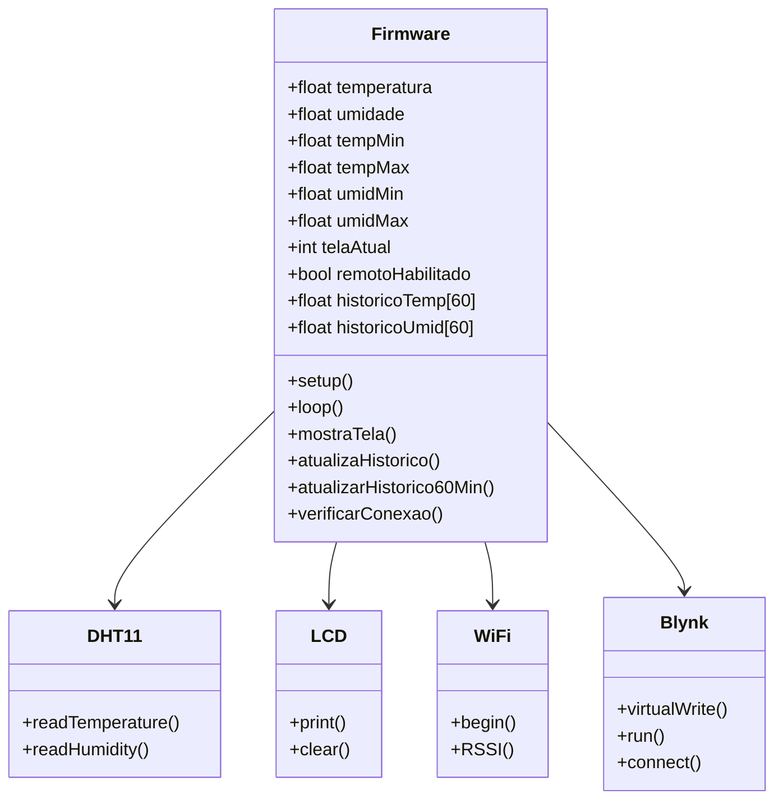
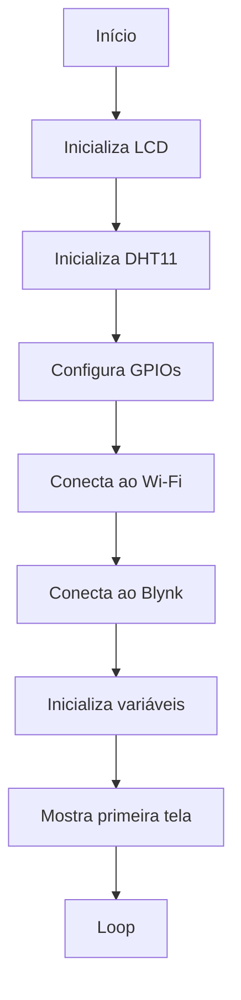
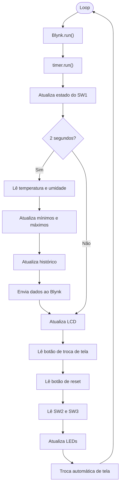
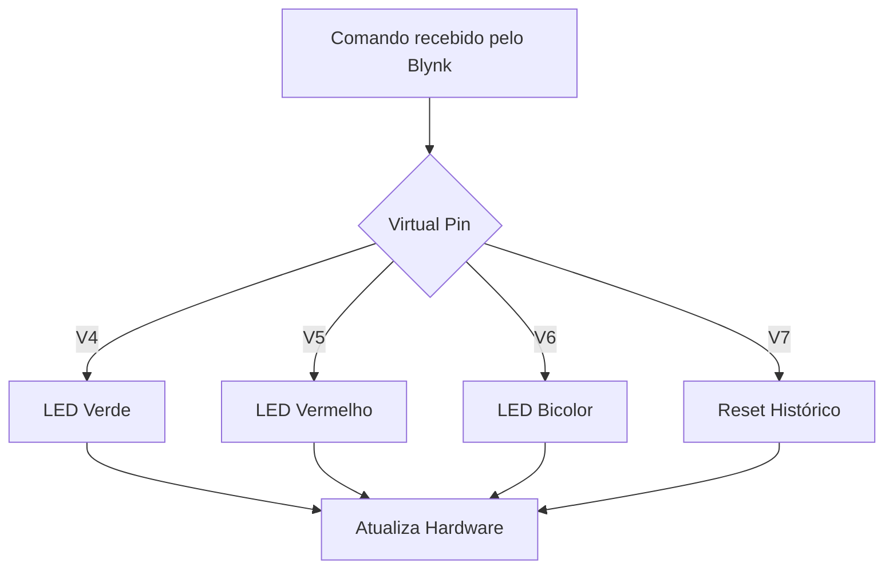

# Monitor de Temperatura e Umidade com ESP32 e Blynk

**Disciplina:** Tópicos Especiais em Computação XXVII (GEX1087)  
**Instituição:** Universidade Federal da Fronteira Sul (UFFS) – Campus Chapecó  
**Integrantes:** Rafaela Gehrke
**Plataforma utilizada:** Blynk IoT

---

# Descrição

Este projeto consiste em um sistema de monitoramento de temperatura e umidade utilizando um **ESP32**, um **sensor DHT11**, um **display LCD I2C** e a plataforma **Blynk IoT**.

O sistema realiza a leitura periódica das variáveis ambientais, exibe as informações localmente no LCD e as envia para um dashboard remoto através da rede Wi-Fi.

Além do monitoramento, o projeto permite o controle local e remoto de LEDs, gerenciamento do histórico de medições e monitoramento da qualidade da conexão Wi-Fi.

---

# Hardware utilizado

- ESP32 Dev Module
- Sensor DHT11
- Display LCD I2C 16x2
- LED Verde
- LED Vermelho
- LED Bicolor
- 2 Push Buttons
- 4 Switches
- Resistores
- Protoboard
- Cabos Jumper

---

# Funcionalidades

- Leitura da temperatura em Celsius
- Conversão automática para Fahrenheit
- Leitura da umidade relativa do ar
- Exibição das informações em LCD
- Histórico de temperatura mínima e máxima
- Histórico de umidade mínima e máxima
- Histórico circular das últimas 60 leituras
- Envio dos dados para o Blynk
- Monitoramento do RSSI da conexão Wi-Fi
- Reconexão automática ao Wi-Fi e ao Blynk
- Controle local dos LEDs
- Controle remoto dos LEDs
- Controle do LED bicolor
- Reset remoto e local do histórico
- Alternância automática entre telas do LCD

---

# Telas do LCD

O LCD possui cinco telas.

| Tela | Informação |
|------|------------|
| 1 | Temperatura (°C) e Umidade |
| 2 | Temperatura (°F) e Umidade |
| 3 | Temperatura mínima e máxima |
| 4 | Umidade mínima e máxima |
| 5 | Status da conexão Wi-Fi/Blynk e RSSI |

O botão **BTN_TELA** permite alternar manualmente entre as telas. Após alguns segundos sem interação, o sistema retorna ao modo automático.

---

# Dashboard Blynk

O dashboard recebe as informações do ESP32 e permite controlar os dispositivos remotamente.

## Datastreams

| Virtual Pin | Função | Tipo | Direção |
|-------------|--------|------|----------|
| V0 | Temperatura (°C) | Double | ESP32 → Blynk |
| V1 | Temperatura (°F) | Double | ESP32 → Blynk |
| V2 | Umidade (%) | Double | ESP32 → Blynk |
| V3 | RSSI Wi-Fi | Integer | ESP32 → Blynk |
| V4 | Controle LED Verde | Integer | Blynk → ESP32 |
| V5 | Controle LED Vermelho | Integer | Blynk → ESP32 |
| V6 | Controle LED Bicolor | Integer | Blynk → ESP32 |
| V7 | Reset do histórico | Integer | Blynk → ESP32 |
| V8 | Estado do controle remoto | Integer | ESP32 → Blynk |
| V9 | Unidade de temperatura | String | ESP32 → Blynk |
| V10 | Estado do LED Verde | Integer | ESP32 → Blynk |
| V11 | Estado do LED Vermelho | Integer | ESP32 → Blynk |

---

# Controle Local e Remoto

O sistema permite controlar os LEDs tanto pelos interruptores físicos quanto pelo aplicativo Blynk.

O funcionamento depende do estado do **SW1**.

| SW1 | Funcionamento |
|------|---------------|
| LOW | Apenas controle físico |
| HIGH | Controle físico e remoto habilitados |

Quando o controle remoto está habilitado (**SW1 em HIGH**), o estado dos LEDs é determinado pelo **último comando recebido**, seja ele enviado pelo aplicativo ou pelos interruptores físicos.

Os widgets LED do Blynk (V10 e V11) permanecem sincronizados com o estado físico dos LEDs.

---

# Histórico

O sistema registra automaticamente:

- Temperatura mínima
- Temperatura máxima
- Umidade mínima
- Umidade máxima

Além disso, mantém um histórico circular contendo as **últimas 60 leituras**, atualizado a cada minuto.

O histórico pode ser reiniciado:

- pelo botão físico **BTN_RESET**;
- pelo botão remoto no Blynk (V7).

---

# Conectividade

Durante a execução, o sistema monitora continuamente:

- conexão Wi-Fi;
- conexão com o Blynk.

Caso alguma conexão seja perdida, é realizada tentativa automática de reconexão.

Também é enviado ao dashboard o valor do **RSSI**, permitindo acompanhar a intensidade do sinal Wi-Fi.

---

# Organização do Firmware

O firmware foi desenvolvido utilizando programação **não bloqueante**, baseada na função `millis()`, evitando interrupções no funcionamento do sistema.

As principais rotinas são responsáveis por:

- leitura do sensor DHT11;
- atualização do LCD;
- envio dos dados ao Blynk;
- monitoramento da conexão;
- gerenciamento do histórico;
- controle dos LEDs;
- tratamento dos botões e switches.

---

# Imagens BLYNK

<table>
<tr>
<td align="center">

</td>

<td align="center">

</td>

<td align="center">

</td>
</tr>
</table>

# Documentação do Projeto

## Arquitetura do Sistema

O projeto consiste em um sistema de monitoramento de temperatura e umidade utilizando um ESP32, sensor DHT11, display LCD I2C e a plataforma Blynk IoT.

O ESP32 realiza a aquisição dos dados do sensor, atualiza o display LCD local e envia as informações para o dashboard Blynk por meio da rede Wi-Fi. O sistema também permite o controle remoto dos LEDs e do LED bicolor, além do reset do histórico e do monitoramento da intensidade do sinal Wi-Fi (RSSI).

---

# Diagrama de Classes



---

# Fluxograma do Firmware

## Setup



---

## Loop Principal



---

## Fluxograma dos Callbacks Blynk



---

## Configurar as credenciais

Criar um arquivo chamado **secrets.h**:

```cpp
#ifndef SECRETS_H
#define SECRETS_H

#define BLYNK_TEMPLATE_ID ""
#define BLYNK_TEMPLATE_NAME ""
#define BLYNK_AUTH_TOKEN ""

const char ssid[] = "";
const char pass[] = "";

#endif
```

---

## Bibliotecas necessárias

Instalar pela Arduino IDE:

- Wire
- LiquidCrystal_I2C
- DHT Sensor Library
- WiFi
- Blynk

---
  
# Segurança

As credenciais da rede Wi-Fi e o Auth Token do Blynk não são armazenados diretamente no código-fonte.

Essas informações devem ser inseridas no arquivo `secrets.h`, que é ignorado pelo Git através do arquivo `.gitignore`.

O acesso ao dashboard do Blynk é protegido pela autenticação da própria plataforma, sendo necessário realizar login em uma conta autorizada.

---

# Limitações Encontradas

Durante o desenvolvimento do projeto foram observadas algumas limitações.

- O plano gratuito do Blynk apresenta restrições quanto ao armazenamento de dados históricos, permitindo apenas a visualização em tempo real e retenção limitada das informações.

- O histórico das medições é armazenado apenas na memória RAM do ESP32, sendo perdido após reinicialização ou desligamento do dispositivo.

- A atualização dos dados depende da estabilidade da conexão Wi-Fi, podendo ocorrer atrasos na sincronização quando a intensidade do sinal é baixa.

- O sensor DHT11 possui precisão inferior quando comparado a sensores mais modernos, como o DHT22, especialmente para medições de temperatura e umidade em ambientes com maior variação.

- O dashboard reflete os estados dos dispositivos em tempo real, porém sua atualização depende da disponibilidade da conexão com a plataforma Blynk.

---

# Estrutura do Projeto

```
Projeto/
│
├── MonitorWiFiESP32.ino
├── secrets.h
├── README.md
```
